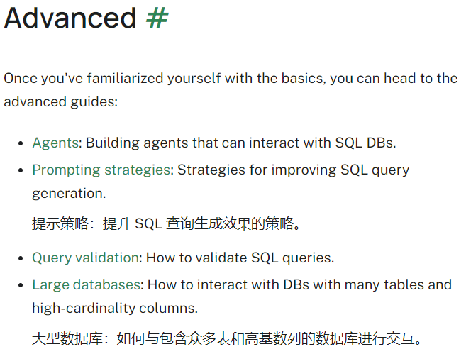

# 数据库交互llm
langchain实现 text2sql
## 详细说明
可参考我的博客：

[基于Langchain的SQL交互Agent](https://bblog.031105.xyz/posts/%E5%AE%9E%E8%B7%B5%E8%AE%B0%E5%BD%95/2024-spring-%E8%BD%AF%E5%B7%A5%E4%B8%89/%E5%9F%BA%E4%BA%8Elangchain%E7%9A%84sql%E4%BA%A4%E4%BA%92agent)

## 参考链接
1. https://python.langchain.com/v0.1/docs/use_cases/sql/

    

   里面有四个进阶教程，本项目参考了其中的prompt教程和fewshot的部分

2. quickStart

   https://python.langchain.com/v0.1/docs/use_cases/sql/quickstart/

## 补充
需要自建下config.py然后补充以下内容
因为有些私人信息，因此不上传

```python
DASHSCOPE_API_KEY = ""

HOST = ""
NAME = ""
USER = ""
PASSWORD = ""

SYSTEM_TEMPLATE = """
你是一个数据库专家，你可以回答用户提出的任何问题。
用户会给出问题、SQL查询以及查询结果，你需要根据这些信息回答用户的问题。
"""

# 可以自己新增
EXAMPLES = [
    {
        "input": "今天哪个仓库的star数最多？",
        "query": "SELECT r.name AS repo_name, r.stars AS star_count FROM repo r JOIN trending t ON r.id = t.repo_id WHERE t.update_time = CURDATE() ORDER BY r.stars DESC LIMIT 1;"
    },
]

PREFIX = """
You are a MySQL expert. Given an input question, create a syntactically correct MySQL query to run. 
Unless otherwise specificed, do not return more than {top_k} rows.
Here is the relevant table info: {table_info}
Below are a number of examples of questions and their corresponding SQL queries.
"""
```
完整config.py链接（仅供我自己记忆使用）

oss://chrisding/llm4db/config.py